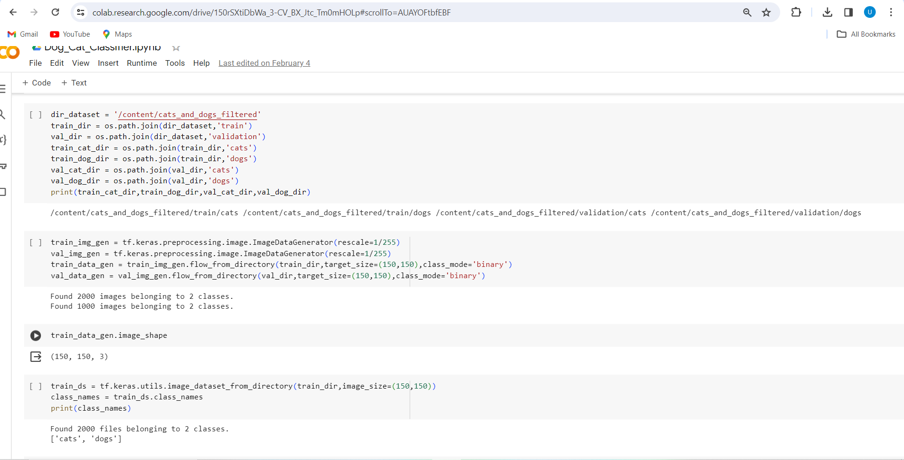
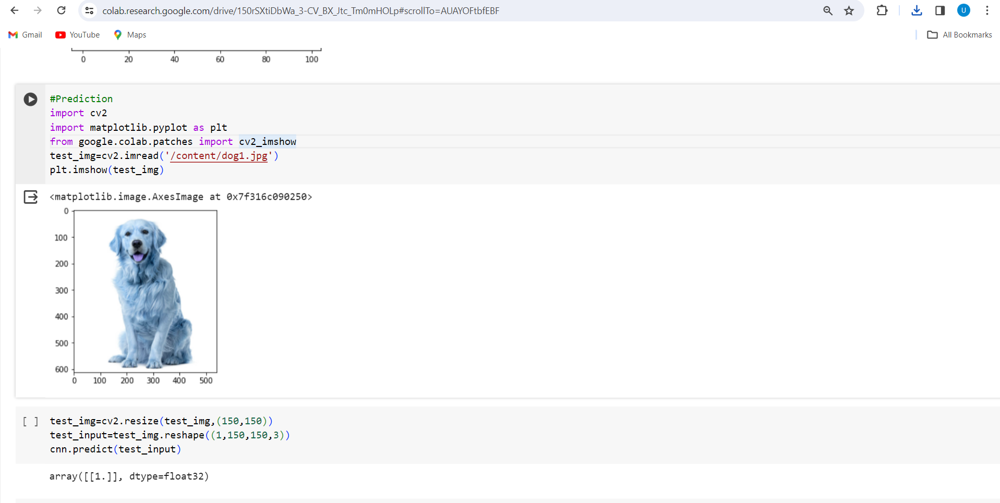

# A Dog Cat classifier using Deep Learning
- This was one of my projects as a part of Rinex AI training and Internship done in my 1st year of Engineering
- The Task involved creating a classifier which whill classify an image as 'Dog' or a 'Cat'
- The Accuracy acheived was nearly 74%

# Following are the images

